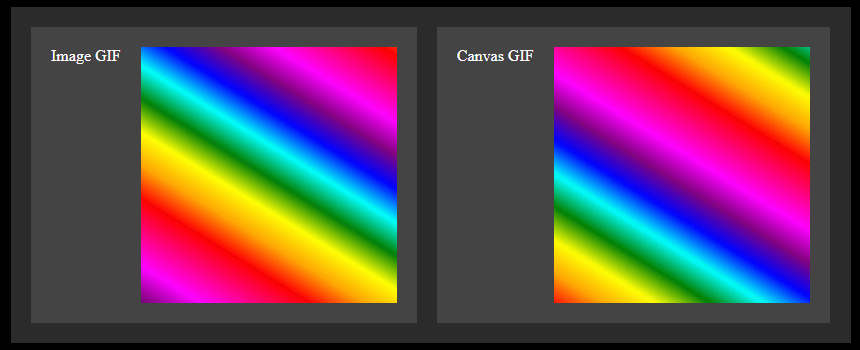

# Overview

* HTML5_GifCanvas draws a GIF animation on a HTML5 canvas.

## Screenshots



## Code Reference

* This sample is derived from the [gifuct-js demo source example](https://raw.githubusercontent.com/matt-way/gifuct-js/master/demo/demo.build.js).

### Dependencies

* [Browserify](https://github.com/browserify/browserify)

```
npm install browserify
```

* [gifuct-js](https://github.com/matt-way/gifuct-js)

```
npm install gifuct-js
```
